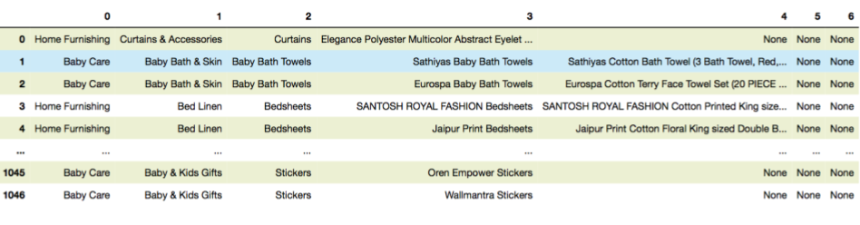
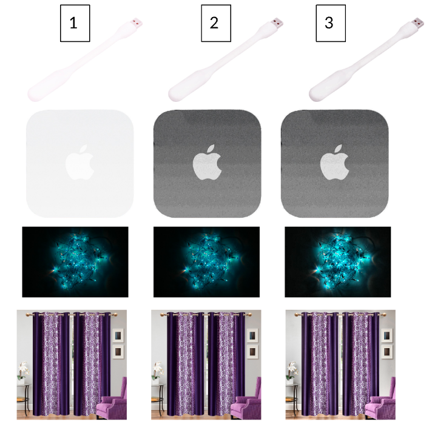
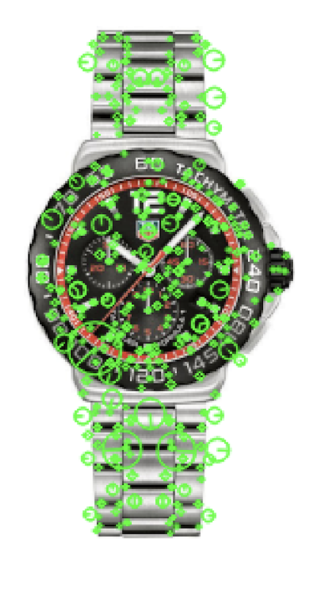
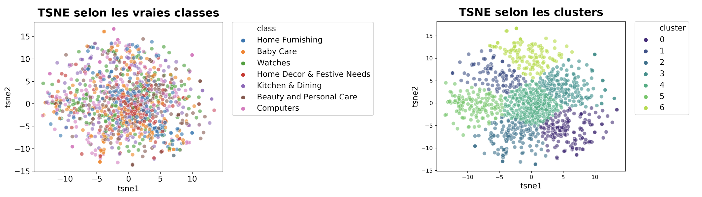
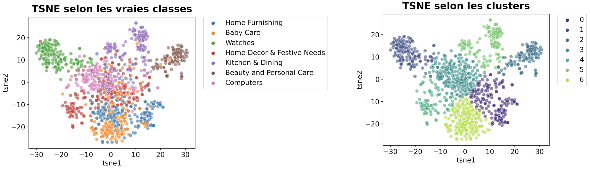

# Place de marché

Il s'agit du 6ème projet de la certification Data Scientist dispensée par OpenClassrooms (sur les huit projets au total). Dans ce projet on étudie la faisabilité d'un moteur de classification des articles en différentes catégories avec un niveau de précision suffisant.

## I Présentation du projet

Vous êtes Data Scientist au sein de l’entreprise "**Place de marché**”, qui souhaite lancer une marketplace e-commerce. Sur la place de marché, des vendeurs proposent des articles à des acheteurs en postant une photo et une description.
Pour l'instant, l'attribution de la catégorie d'un article est effectuée manuellement par les vendeurs et est donc peu fiable. De plus, le volume des articles est pour l’instant très petit. Pour rendre l’expérience utilisateur des vendeurs (faciliter la mise en ligne de nouveaux articles) et des acheteurs (faciliter la recherche de produits) la plus fluide possible et dans l'optique d'un passage à l'échelle, **il devient nécessaire d'automatiser cette tâche**. **Linda**, lead data scientist, vous demande donc d'étudier la faisabilité d'un **moteur de classification** des articles en différentes catégories, avec un niveau de précision suffisant.

### Les données
Linda vous a fourni un premier jeu de données d’articles avec le lien pour télécharger la photo et une description associée.

### Votre mission
Votre mission est de **réaliser une première étude de faisabilité d'un moteur de classification** d'articles basé sur une image et une description pour l'automatisation de l'attribution de la catégorie de l'article.
Vous **analyserez le jeu de données** en **réalisant un prétraitement** des images et des descriptions des produits, une **réduction de dimension**, puis un **clustering**. Les résultats du clustering seront présentés sous la forme d’une représentation en deux dimensions à déterminer, qui illustrera le fait que les caractéristiques extraites permettent de regrouper des produits de même catégorie.
La représentation graphique vous aidera à convaincre Linda que cette approche de modélisation permettra bien de regrouper des produits de même catégorie.
Attention, Linda n’a pas besoin d’un moteur de classification à ce stade, mais bien d’une étude de faisabilité !

__Contraintes__
Linda vous a communiqué la contrainte suivante : afin d’extraire les features, mettre en œuvre a minima un algorithme de type SIFT / ORB / SURF.
Un algorithme de type CNN Transfer Learning peut éventuellement être utilisé en complément, s’il peut apporter un éclairage supplémentaire à la démonstration.

## II Résultats
### II.1 La classification textuelle
Le jeu de données se présente sous la forme d'une table de 1050 lignes et 15 colonnes, mais seulement trois d'entre elles sont utiles pour notre analyse:
1. La première colonne renseigne sur les catégories auxquelles appartient chaque produit
2. la deuxième colonne contient une description textuelle du produit
3. la troisième colonne contient le nom du fichier image correspondant au produit.

A chaque produit sont associées plusieurs catégories organisées hiérarchiquement selon 7 niveaux; mais la plupart des produits ne sont pas associés à 7 catégories différentes: les niveaux 6 et 7 de la hiérarchie sont vides pour la plupart des produits: 

\
*Les catégories, organisées hiérarchiquement en 7 niveaux (0 à 6). Chaque ligne représente un produit et l'ensemble des catégories auxquelles il est associé.*

Par ailleurs, il y a exactement 150 produits par catégorie au niveau 0. Ceci conduit à ne choisir de tester la possibilité de classer les produits qu'en se référant aux catégores les plus "larges", c'est-à-dire celles du niveau 0.

L'apprentissage se fait donc en s'appuyant sur:
1. La catégorie retenue
2. L'analyse de la description

Chaque description est analysée selon les étapes suivantes:
1. Détection de la langue utilisée (`langdetect`)
2. Nettoyage: *stopwords* et caractères spéciaux ('\r', '\n', '\t', 'rs.' etc.)
3. Lemmatisation: pour cela on utilise les bibliothèques `spaCy` et `NLTK`.

Une fois les descriptions nettoyées et normalisées, on procède à la vectorisation du corpus à l'aide de l'algorithme TF-IDF. La matrice obtenue contient beaucoup plus de colonnes que de lignes, on procède donc à une réduction dimensionnelle avant de passer à la segmentation. Plusieurs méthodes ont été testées, mais celle qui donne les meilleurs résultats ici fait appel à la technique de [*Latent Semantic Analysis*](https://nlp.stanford.edu/IR-book/pdf/18lsi.pdf) associée à la segmentation avec K-Means. Pour visualiser les clusters et les comparer à la classification réelle on utilise l'algorithme `t-SNE` pour réduire encore la dimensionalité et ne garder que deux composantes pour pouvoir présenter les résultats dans un plan:
 

La segmentation réalisée à l'aide de la combinaison *LSA + K-Means* est évaluée en la comparant à la classification réelle selon les catégories de niveau 0 et en calculant l'indice de Rand ajusté. Cet indice prend une valeur proche de 0 lorsque les produits sont classés de manière quasi-aléatoire, et vaut 1 lorsque les segmentations (prédite et réelle) sont identiques. Il vaut ici 0.64 ce qui indique que la segmentation donne des résultats intéressants, résultats qu'il faudrait sans doute explorer et améliorer dans le cadre d'un moteur de classification mais qui constituent une base intéressante.

Pour aller plus loin et mieux caractériser les résultats, on peut aussi inspecter la matrice de confusion associée à cette classification:

\
*Matrice de confusion (gauche) et résultats de la classification (droite)*

Les éléments diagonaux de la matrice de confusion représentent le nombre de produits correctement classés. Les scores de précision, rappel et F1 sont présentés sur la partie droite. La précision indique la capacité du classificateur à ne pas classer incorrectement des produits, tandis que le rappel indique la capacité du classificateur à identifier correctement tous les produits appartenant à une catégorie donnée. Le score F1 est une moyenne harmonique des scores de précision et de rappel. Chacun de ces scores ont une valeur égale à 1 dans le cas d'une classification parfaite, et de 0 dans le cas où les produits ont été classés aléatoirement. Dans le cas présent, les scores de précision et de rappel valent en moyenne environ 0,82 ce qui est (encore une fois) encourageant dans la perspective d'un moteur de classification.

### II.2 La classification d'après les images
Dans cette deuxième partie, on souhaite démontrer la possibilité de réaliser une classification automatique des produits grâce à l'analyse de leurs vignettes. Deux stratégies sont envisagées: la première repose sur l'utilisation de l'algorithme SIFT (scale-invariant feature transform), la deuxième sur un réseau de neurones à convolution pré-entraîné. On pourra ainsi comparer les résultats et l'efficacité de chaque approche. 

Après avoir vérifié l'intégrité des images récupérées (sont-elles toutes présentes, y a-t-il des images entièrement blanches ou noires, ou trop bruitées pour être exploitables directement), on peut passer à l'analyse à proprement parler. 

**1. Classification avec SIFT**

SIFT (scale-invariant feature transform) est un algorithme développé en 1999 par le chercheur David Lowe permettant de détecter des *features* ou caractéristiques présentes dans des images et permettant de les différencier ou au contraire de les regrouper en classes. Les *descripteurs SIFT* sont ainsi décrits sur la page Wikipédia: 
> Il s'agit d'informations numériques dérivées de l'analyse locale d'une image et qui caractérisent le contenu visuel de cette image de la façon la plus indépendante possible de l'échelle (« zoom » et résolution du capteur), du cadrage, de l'angle d'observation et de l'exposition (luminosité).

\
*Résultats du prétraitement des images sur quatre exemples. 1: image originale. 2: image obtenue après correction de l'exposition. 3: correction obtenue après correction du contraste.*

Après avoir réalisé un prétraitement consistant à corriger l'exposition et le constraste, on cherche en premier lieu à détecter les features et à calculer les descripteurs, c'est-à-dire les vecteurs de taille 128 encodant les informations liées au voisinage des features. 

\
*Descripteurs SIFT*

A ce stade, chaque image est donc représentée par les descripteurs qui la compose. L'étape suivante consiste à associer aux descripteurs les *visual words* qui serviront à décrire les images: les descripteurs sont groupés en classes dont les centroïdes représentent les visual words. Pour cahque image, on remplace chaque descripteur par le *visual word* associé. Ceci permet (en principe) de repérer les images similaires, c'est-à-dire celles décrites par un ensemble "proche" de *visual words*: la classification des images est réalisée grâce à l'algorithme K-Means appliqué à la matrice obtenue dont chaque ligne représente une image, et dont les colonnes représentent les fréquences des *visual words*. Pour évaluer la qualité de la segmentation obtenue, on s'appuie sur deux méthodes:
- une méthode "visuelle", qui consiste à comparer les classes calculées aux classes réelles
- une méthode plus rigoureuse qui repose sur le score de Rand ajusté ([Adjusted Rand Score](https://scikit-learn.org/stable/modules/generated/sklearn.metrics.adjusted_rand_score.html#sklearn.metrics.adjusted_rand_score))

Le principe de la méthode "visuelle" est le suivant:
1. On associe à chaque image son étiquette réelle - celle issue du jeu de données- et on applique une réduction de dimension à la matrice dont les lignes représentent les images et les colonnes les fréquences des *visual words*, de manière à obtenir pour chaque image une représentation en deux dimensions
2. On réalise (encore) une segmentation sur cette représentation 2D, et on compare les clusters obtenus aux étiquettes réelles.

On calcule également le score de Rand ajusté sur ces deux segmentations pour évaluer rigoureusement le résultat.

\
*Comparaison des segmentations réelle et calculée*

Le score de Rand ajusté vaut 0.04, ce qui indique une segmentation quasi-aléatoire, résultat cohérent avec l'évaluation "visuelle". Dans notre cas, avec les paramètres choisis, la méthode reposant sur l'algorithme SIFT ne permet pas d'obtenir de  bons résultats.

**2. Classification avec un CNN et *transfer learning***
On utilise ici la puissance des réseaux de neurones pour la reconnaissance d'image. Le jeu de données étant particulièrement réduit, il ne va pas être question d'entraîner un réseau de neurones sur ce jeu à partir de zéro, mais d'utiliser un réseau pré-entraîné et d'appliquer la technique du *transfer learning* sur ce réseau, c'est-à-dire d'utiliser les *features* calculées sur un autre jeu d'entraînement pour classer les images. Dans notre cas le réseau choisi est VGG16, réseau entraîné sur le jeu de données ImageNet et permettant de classifier chaque image dans une des 1000 classes ImageNet.

En principe, on devrait ré-entraîner le modèle sur le jeu de données qu'on cherche à classifier. Pour réaliser cela, on retire du modèle VGG16 les 3 dernières couches - celles permettant la classification à proprement parler à partir des *features* calculées, et on remplace ces couches par d'autres couches *fully connected* plus adaptées au problème: par exemple une nouvelle classe *fully connected* ne contenant que 10 paramètres en sorties au lieu de 1000 dans VGG16 pourune classification en 10 classes par exemple. Ici, nous n'allons même pas ré-entrainer le modèle sur notre jeu de données: on va simplement utiliser les *features* extraites pour chaque image par le CNN, et appliquer la même méthodologie que ci-dessus pour évaluer la possibilité d'une segmentation. 

Dans notre cas, donc, la sortie du CNN dont les trois dernières couches *fully connected* ont été retirées joue le même rôle que la matrice des *visual words* de la partie précédente.

\
*Comparaison des segmentations réelle et calculée à partir du traitement via le réseau de neurones à convolution VGG16*

Première observation: les catégories sont visuellement repérables, ce qui est bon signe. Le score de Rand ajusté vaut maintenant 0,48 ce qui est significativement mieux que le résultat obtenu avec SIFT.

## Conclusion

La classification automatique des produits du jeu de données semble faisable:
- le score de segmentation à l'aide des descriptions textuelles vaut 0.64, ce qui indique que la segmentation réalisée est pertinente. Il faudrait chercher à améliorer ce score cependant, et on peut imaginer sans doute plusieurs pistes, à savoir:
    - une meilleure analyse des descriptions, notamment grâce à des outils de *natural language processing* plus puissants
    - une re-définition des catégories plus pertinente, notamment en mixant des catégories de premier et deuxièmes niveaux

- le score obtenu pour la segmentation des images vaut 0.48 et est encourageant, en particulier lorsqu'on garde en tête qu'*on n'a pas entraîné le réseau de neurones* sur le jeu de données. Donc une amélioration significative est attendue dans le cas d'un *tranfer learning* suivi d'un entraînement du CNN sur le jeu de données.

Avec ces améliorations, la réalisation d'un moteur de classification semble à portée de main!
