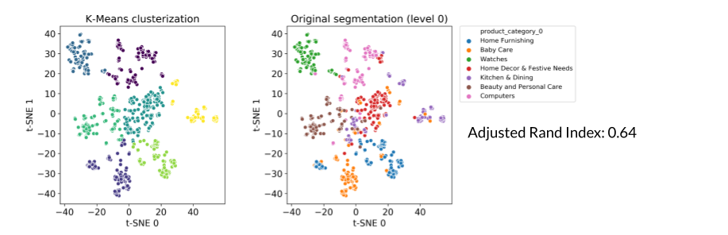
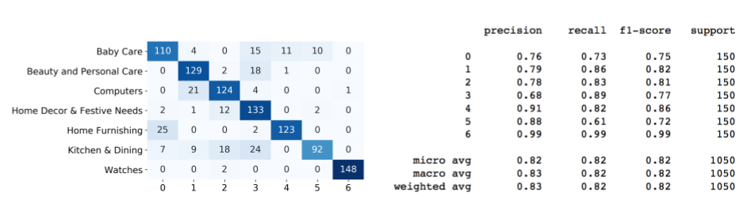

# Place de marché

Il s'agit du 6ème projet de la certification Data Scientist dispensée par OpenClassrooms (sur les huit projets au total). Dans ce projet on étudie la faisabilité d'un moteur de classification des articles en différentes catégories avec un niveau de précision suffisant.

# I Présentation du projet

Vous êtes Data Scientist au sein de l’entreprise "**Place de marché**”, qui souhaite lancer une marketplace e-commerce. Sur la place de marché, des vendeurs proposent des articles à des acheteurs en postant une photo et une description.
Pour l'instant, l'attribution de la catégorie d'un article est effectuée manuellement par les vendeurs et est donc peu fiable. De plus, le volume des articles est pour l’instant très petit. Pour rendre l’expérience utilisateur des vendeurs (faciliter la mise en ligne de nouveaux articles) et des acheteurs (faciliter la recherche de produits) la plus fluide possible et dans l'optique d'un passage à l'échelle, **il devient nécessaire d'automatiser cette tâche**. **Linda**, lead data scientist, vous demande donc d'étudier la faisabilité d'un **moteur de classification** des articles en différentes catégories, avec un niveau de précision suffisant.

## Les données
Linda vous a fourni un premier jeu de données d’articles avec le lien pour télécharger la photo et une description associée.

## Votre mission
Votre mission est de **réaliser une première étude de faisabilité d'un moteur de classification** d'articles basé sur une image et une description pour l'automatisation de l'attribution de la catégorie de l'article.
Vous **analyserez le jeu de données** en **réalisant un prétraitement** des images et des descriptions des produits, une **réduction de dimension**, puis un **clustering**. Les résultats du clustering seront présentés sous la forme d’une représentation en deux dimensions à déterminer, qui illustrera le fait que les caractéristiques extraites permettent de regrouper des produits de même catégorie.
La représentation graphique vous aidera à convaincre Linda que cette approche de modélisation permettra bien de regrouper des produits de même catégorie.
Attention, Linda n’a pas besoin d’un moteur de classification à ce stade, mais bien d’une étude de faisabilité !

__Contraintes__
Linda vous a communiqué la contrainte suivante : afin d’extraire les features, mettre en œuvre a minima un algorithme de type SIFT / ORB / SURF.
Un algorithme de type CNN Transfer Learning peut éventuellement être utilisé en complément, s’il peut apporter un éclairage supplémentaire à la démonstration.

# II Résultats
## II.1 La classification textuelle
Le jeu de données se présente sous la forme d'une table de 1050 lignes et 15 colonnes, mais seulement trois d'entre elles sont utiles pour notre analyse:
1. La première colonne renseigne sur les catégories auxquelles appartient chaque produit
2. la deuxième colonne contient une description textuelle du produit
3. la troisième colonne contient le nom du fichier image correspondant au produit.

A chaque produit sont associées plusieurs catégories organisées hiérarchiquement selon 7 niveaux; mais la plupart des produits ne sont pas associés à 7 catégories différentes: les niveaux 6 et 7 de la hiérarchie sont vides pour la plupart des produits: 

Par ailleurs, il y a exactement 150 produits par catégorie au niveau 0. Ceci conduit à ne choisir de tester la possibilité de classer les produits qu'en se référant aux catégores les plus "larges", c'est-à-dire celles du niveau 0.

L'apprentissage se fait donc en s'appuyant sur:
1. La catégorie retenue
2. L'analyse de la description

Chaque description est analysée selon les étapes suivantes:
1. Détection de la langue utilisée (`langdetect`)
2. Nettoyage: *stopwords* et caractères spéciaux ('\r', '\n', '\t', 'rs.' etc.)
3. Lemmatisation: pour cela on utilise les bibliothèques `spaCy` et `NLTK`.

Une fois les descriptions nettoyées et normalisées, on procède à la vectorisation du corpus à l'aide de l'algorithme TF-IDF. La matrice obtenue contient beaucoup plus de colonnes que de lignes, on procède donc à une réduction dimensionnelle avant de passer à la segmentation. Plusieurs méthodes ont été testées, mais celle qui donne les meilleurs résultats ici fait appel à la technique de *Latent Semantic Allocation* associée à la segmentation avec K-Means. Pour visualiser les clusters et les comparer à la classification réelle on utilise l'algorithme `t-SNE` pour réduire encore la dimensionalité et ne garder que deux composantes pour pouvoir présenter les résultats dans un plan:
 

La segmentation réalisée à l'aide de la combinaison *LSA + K-Means* est évaluée en la comparant à la classification réelle selon les catégories de niveau 0 et en calculant l'indice de Rand ajusté. Cet indice prend une valeur proche de 0 lorsque les produits sont classés de manière quasi-aléatoire, et vaut 1 lorsque les segmentations (prédite et réelle) sont identiques. Il vaut ici 0.64 ce qui indique que la segmentation donne des résultats intéressants, résultats qu'il faudrait sans doute explorer et améliorer dans le cadre d'un moteur de classification mais qui constitue une base intéressante.

Pour aller plus loin et mieux caractériser les résultats, on peut aussi inspecter la matrice de confusion associée à cette classification:

Les éléments diagonaux de la matrice de confusion (à gauche) représentent le nombre de produits correctement classés. A droite, les scores associés aux métriques précision, rappel et F1. La précision indique la capacité du classificateur à ne pas classer incorrectement des produits, tandis que le rappel indique la capacité du classificateur à identifier correctement tous les produits appartenant à une catégorie donnée. Le score F1 est une moyenne harmonique des scores de précision et de rappel. Chacun de ces scores ont une valeur égale à 1 dans le cas d'une classification parfaite, et de 0 dans le cas où les produits ont été classés aléatoirement. Dans le cas présent, les scores de précision et de rappel valent en moyenne environ 0,82 ce qui est (encore une fois) encourageant dans la perspective d'un moteur de classification.

## II.2 La classification d'après les images
